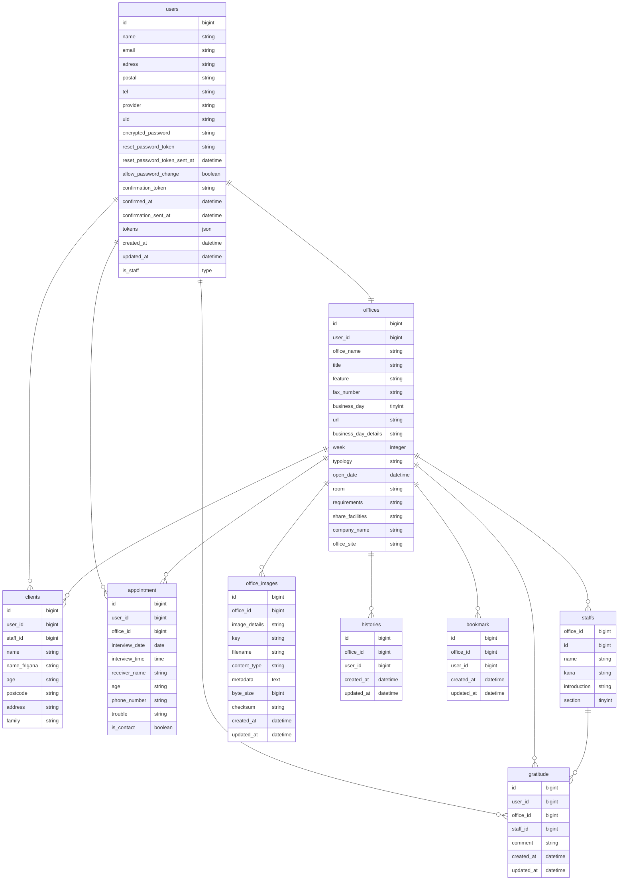
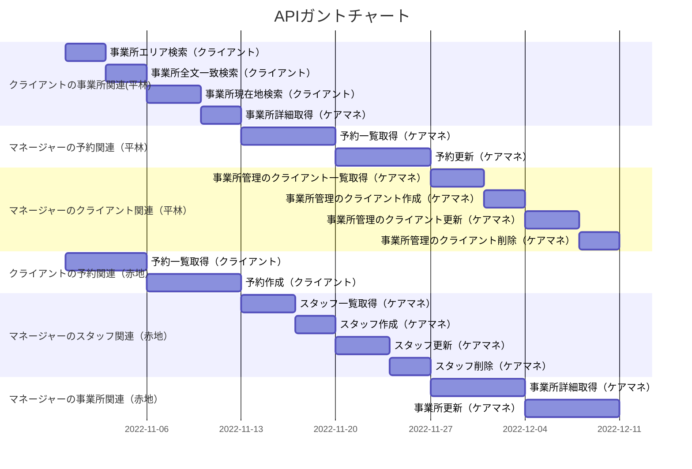

# PRUMアカデミー

## ホームケアナビ作成用PJ(API)

### 環境構築
1. APIリポジトリをクローンする　`https://github.com/rtkjm22/homeCareNavi_2nd_API.git`
2. クローンしたAPIリポジトリに移動する　`cd homeCareNavi_2nd_API`
3. compose.ymlを元に、dockerのdbイメージ及びapiイメージを立ち上げる　`docker compose build`
4. 作成したイメージを元に、dockerコンテナを作成及び起動する　`dokcer compose up -d`

#### 以下をアドレスバーに打ち込んで、{ message: 'API Health Check OK' } が返ってくればOK
- http://localhost:3000/health_check

#### 主に使用するdockerコマンド
コマンド|説明 
--|--
`docker compose build` | dockerイメージを作成する。Dockerfileを変更した後は、再度これを実行してイメージを再作成する
`docker compose up` | compose.ymlを元にコンテナを作成する。compose.ymlを変更した際は、再度これを実行してコンテナを再作成する。 -dフラグでバックグラウンド実行。
`docker compose start` | api及びdbコンテナを起動する
`docker compose stop` | api及びdbコンテナを停止する
`docker compose exec api ash` | 起動中のapiコンテナに接続する
`docker compose ps` | 起動中のコンテナを確認する
`docker compose logs api` | apiコンテナのログを確認する。追従するには-fフラグ。ログが多い場合は--tail 100で直近100行目から開始

#### githubから最新のopenapiを取得
- `rake development:fetch_openapi`

#### 詳細情報

name|version
--|--
Ruby | 3.1.1
Ruby on Rails | 7.0.2.3

#### ER図

## ガントチャート
